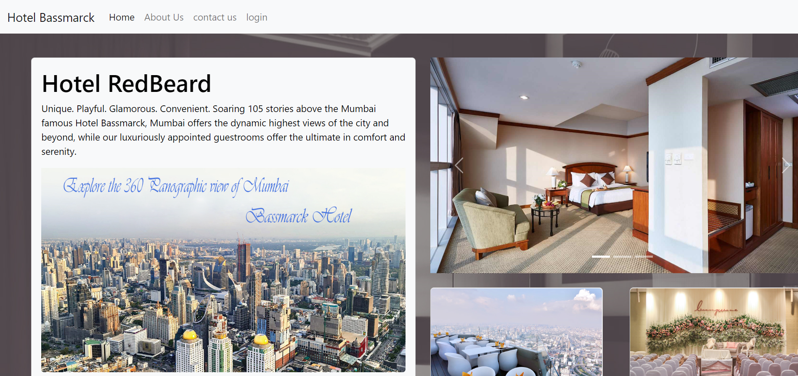

# Hotel_Management_System
A Database Management System based project built using Django, MySQL, HTML and CSS. In this project we are managing all the necessary things that are required in any hotel like room booking, complain booking ,food ordering etc.

## Installation

First Need to install required python packages

```bash
  pip install django
  pip install mysql-connector-python
```
After that go to main directory of project and write following in terminal

```bash
  python manage.py runserver

```

## Screenshots
Home



