# Hotel_Management_System
A Database Management System based project built using Django, MySQL, HTML and CSS. In this project we are managing all the necessary things that are required in any hotel like room booking, complain booking ,food ordering etc.


## Database Schema (ER-Diagram)
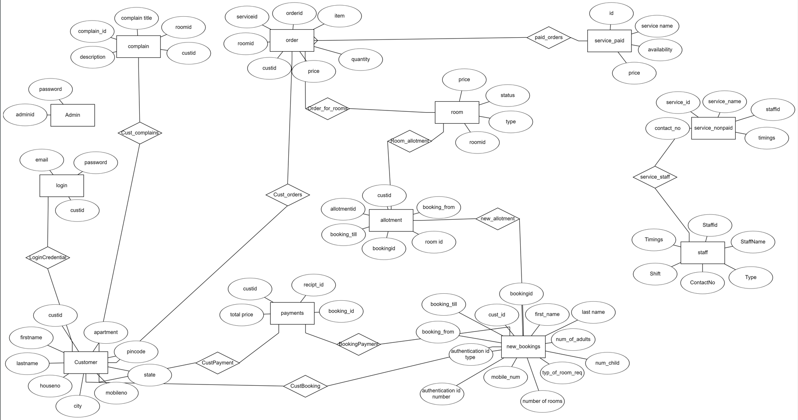


## Installation

First Need to install required python packages

```bash
  pip install django
  pip install mysql-connector-python
```
After that go to main directory of project and write following in terminal

```bash
  python manage.py runserver

```

## Screenshots
Home


Registration
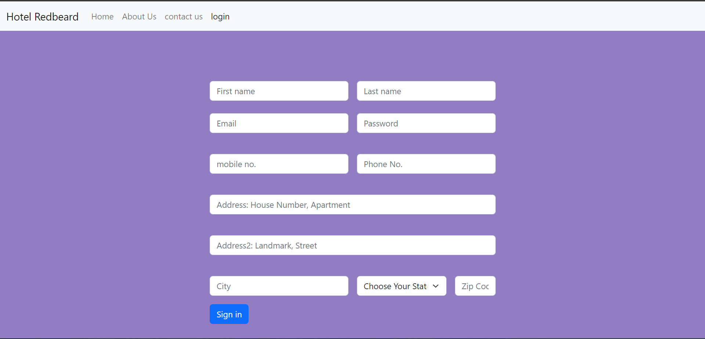

Customer Login
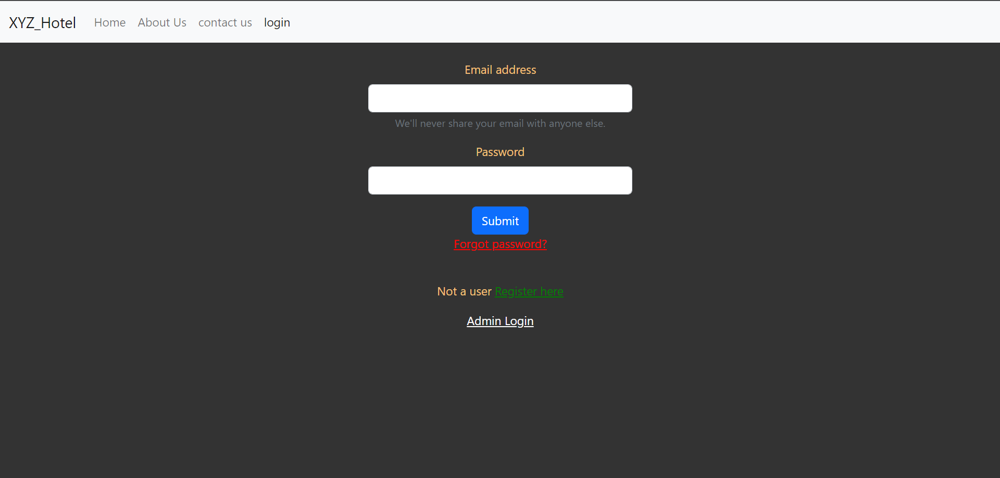

User Dashboard
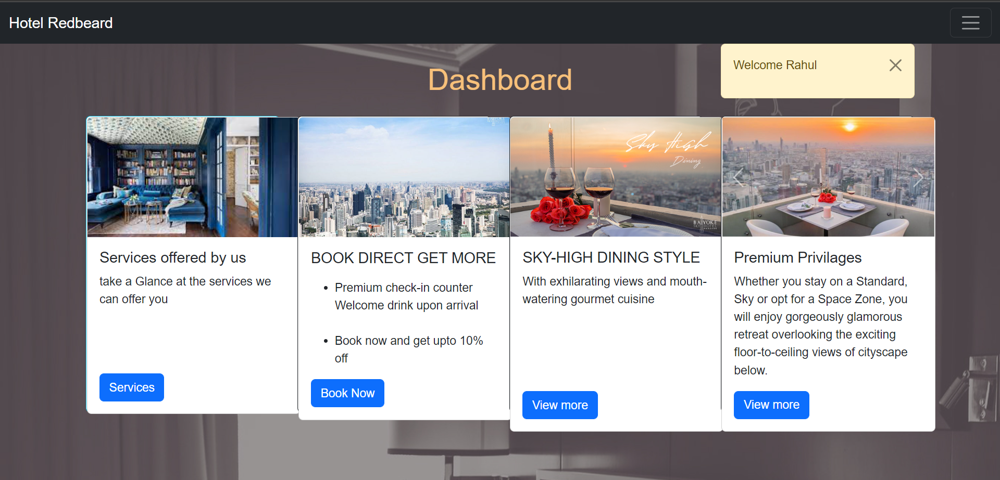

My Bookings
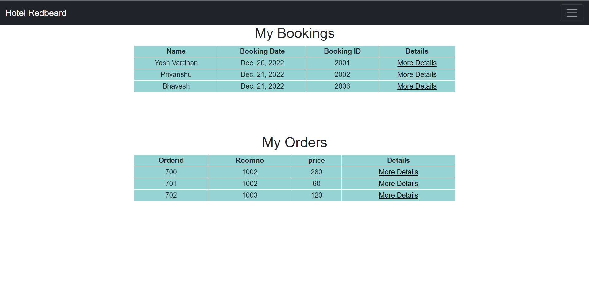

New Booking
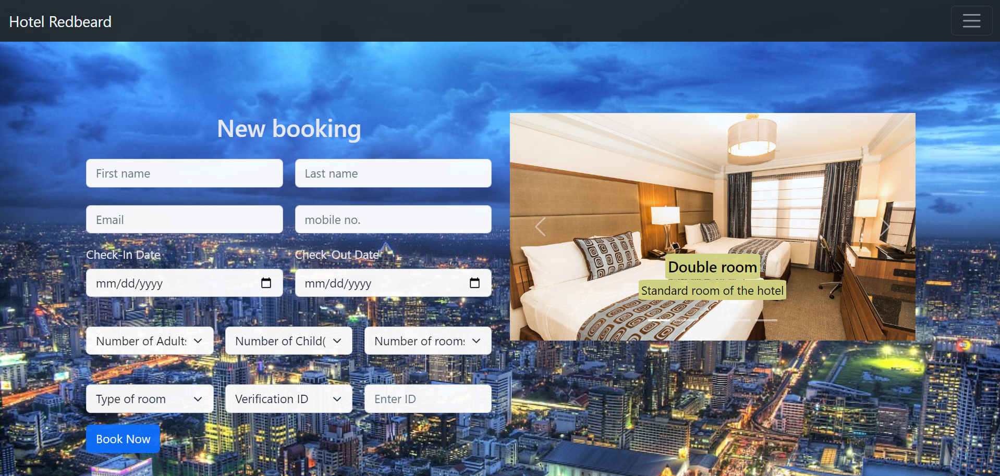

Log A complain
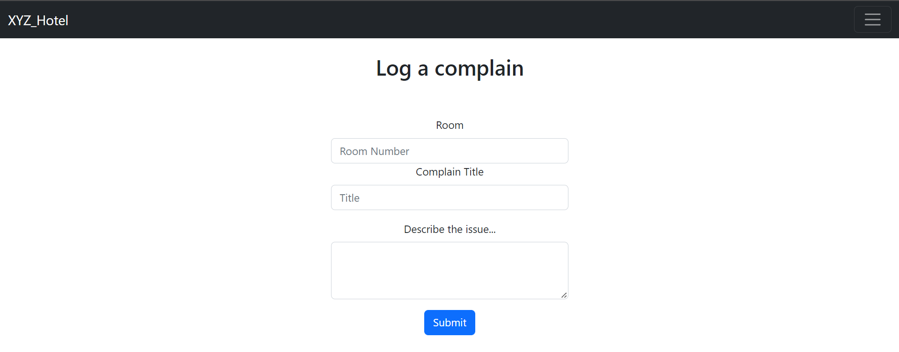

Services
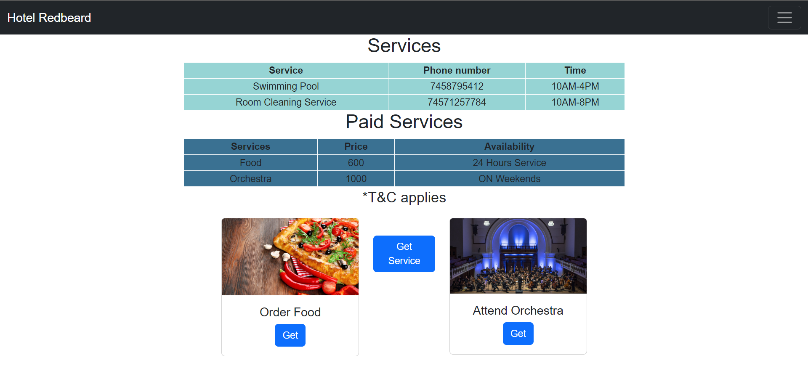

Order Food
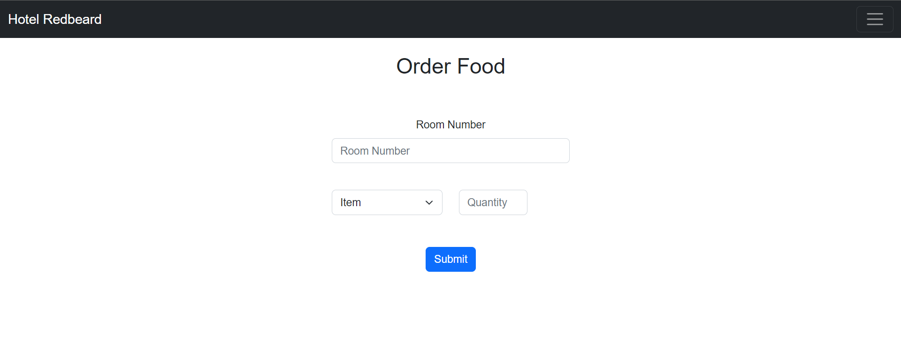

Admin Dashboard
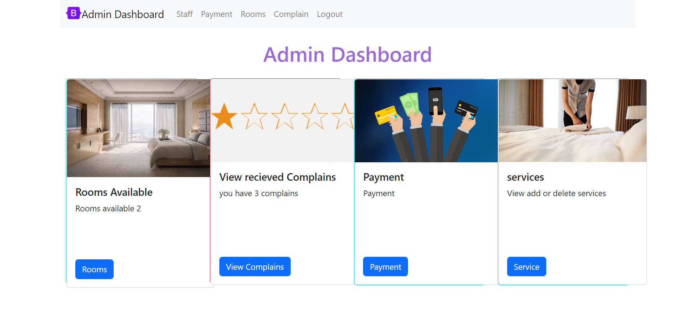

Complain Record
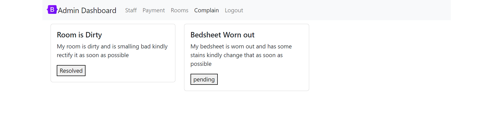

Rooms Details
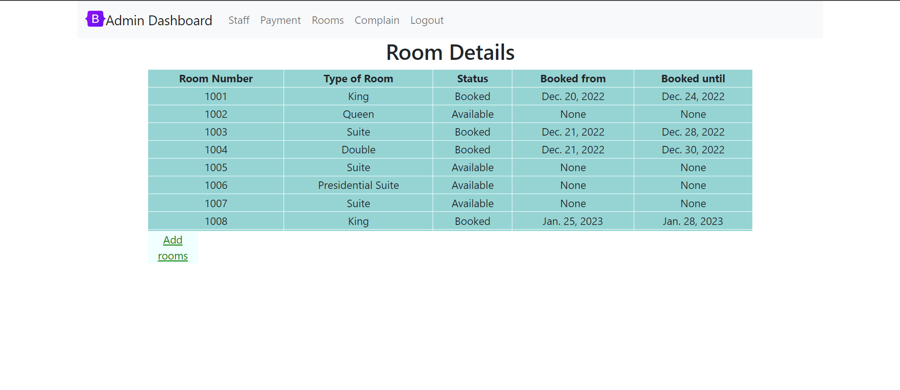

Staff Details
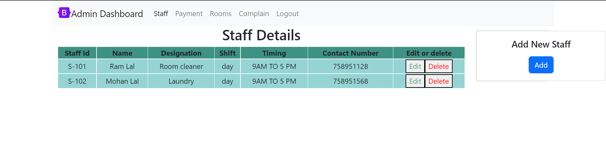

Add New Staff
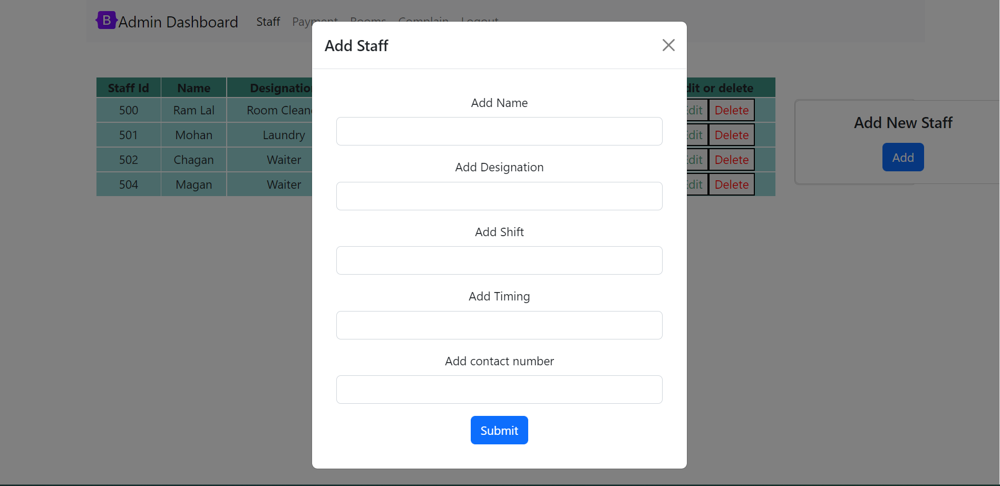

Payment History
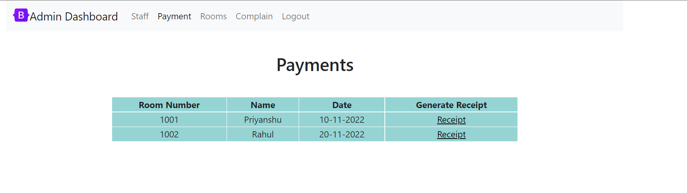

Receipt Generation
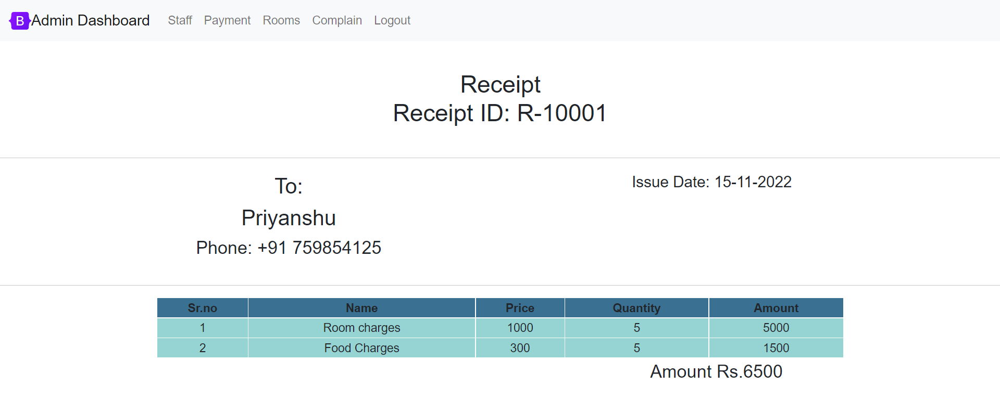


